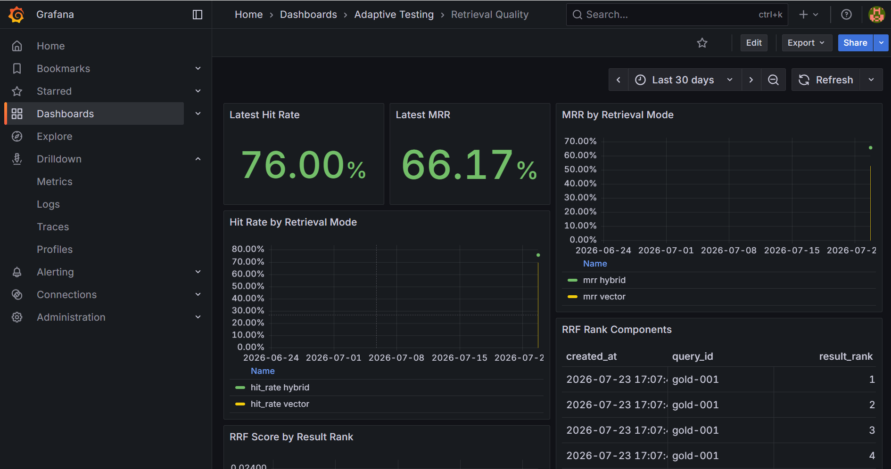
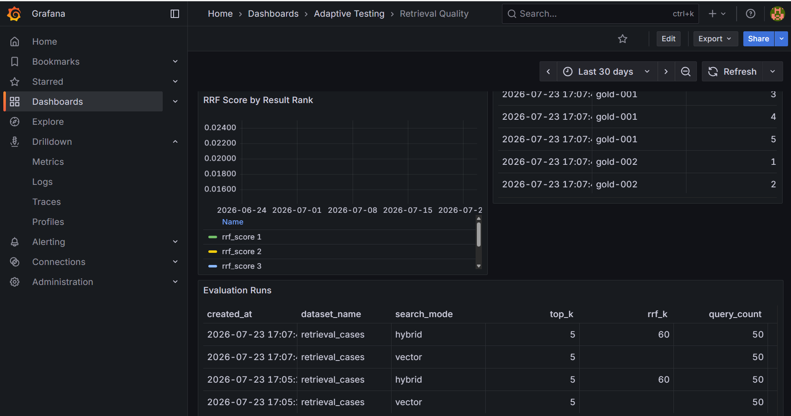
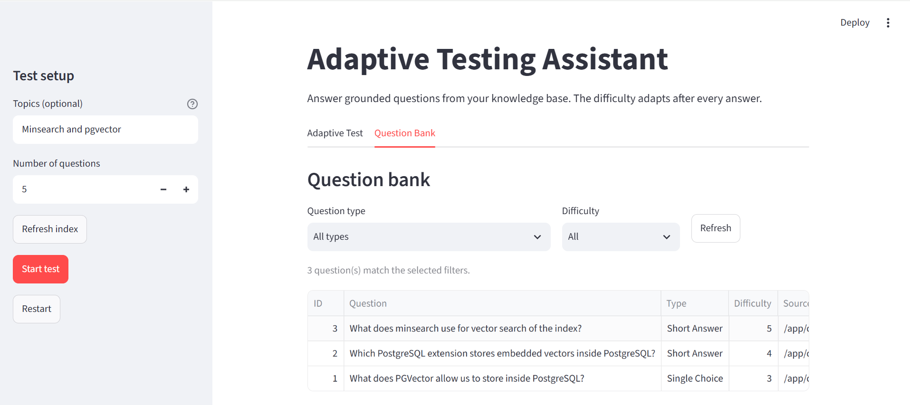
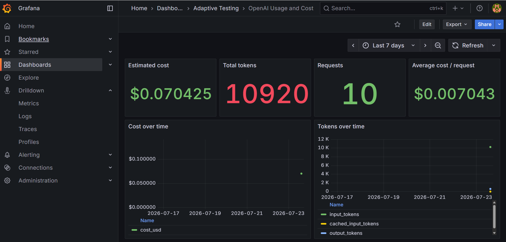
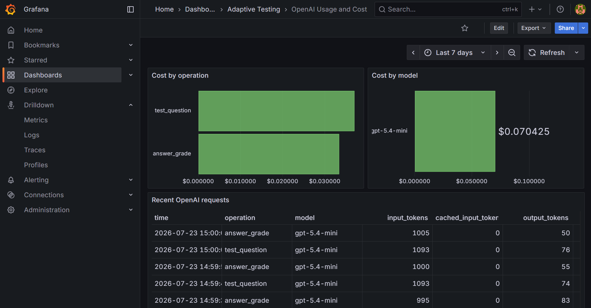
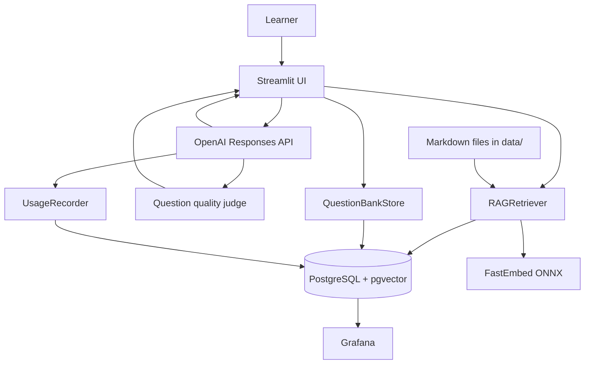

# Adaptive Testing Assistant

Adaptive Testing Assistant helps learners practice from their own Markdown knowledge base. It retrieves relevant document context, generates short-answer or multiple-choice questions, adapts difficulty after each answer, and stores unique generated questions for later review.

The project is designed for local learning, experimentation, and inspection of a complete RAG application: Streamlit UI, PostgreSQL/pgvector retrieval, local ONNX embeddings, OpenAI generation and grading, question-bank persistence, and Grafana usage monitoring.

## What problem does it solve?

Creating a useful practice test from personal notes is time-consuming:

- A learner must search through documents before writing questions.
- Static quizzes do not adjust when a learner answers correctly or incorrectly.
- Generated questions are easy to lose after a test.
- API usage and estimated cost are difficult to inspect without instrumentation.

This application turns Markdown notes into grounded adaptive tests. It keeps the Markdown files as the source of truth, retrieves context with pgvector, asks OpenAI to generate and grade questions, and stores only semantically unique questions in PostgreSQL.

## See it running

Start the application with Docker Compose and open:

- Streamlit: http://localhost:8501
- Grafana: http://localhost:3000
- PostgreSQL: localhost:5432

The main workflow is:

1. Add Markdown files under `data/`.
2. Start the services.
3. Enter one or more comma-separated topics, such as `Python, PostgreSQL`.
4. Choose the number of questions.
5. Answer questions and receive immediate grading feedback.
6. Open the **Question Bank** tab to browse stored questions.
7. Open Grafana to inspect token usage and estimated cost.

There is no hosted demo in this repository. The Docker Compose setup is the reproducible demo environment.

## Demo

This repository does not have a public hosted deployment. The reproducible demo runs locally with Docker Compose.

A typical session looks like this:

1. Enter `Python, PostgreSQL` in the topic field, or leave it blank for a random topic.
2. Start a 20-question test.
3. The retriever searches each topic, and the quality judge checks the generated question against the retrieved context.
4. Submit an answer to see the learner-answer grade, correct answer, and explanation.
5. Continue with **Next question**; difficulty adapts after each answer.
6. Inspect stored approved questions and usage metrics in the Question Bank and Grafana dashboards.

The main UI is available at `http://localhost:8501` after startup. Grafana is available at `http://localhost:3000`.

Some sample images:











## Features

- RAG over Markdown files using PostgreSQL and pgvector.
- Local FastEmbed/ONNX embeddings; no embedding API cost.
- Hybrid vector and PostgreSQL full-text search.
- Multiple topics entered as a comma-separated list.
- Random topic selection when no topic is entered.
- Short-answer, single-choice, and multiple-choice questions.
- Adaptive difficulty from 1 to 5.
- Answer feedback showing the submitted answer, correct answer, explanation, and next-question control.
- Early test termination.
- Question-bank persistence with source paths, difficulty, answers, and explanations.
- Semantic duplicate filtering: a question is stored only when nearest-question cosine similarity is strictly below 0.95.
- Streamlit Question Bank tab with type and difficulty filters.
- OpenAI token and cost recording in PostgreSQL.
- Grafana dashboard for usage and cost over time.

## Quick start

### Prerequisites

- Docker Desktop with Docker Compose
- An OpenAI API key
- PowerShell on Windows, or equivalent shell commands on other platforms
- At least one Markdown file for the knowledge base

The recommended setup runs Python, PostgreSQL, pgvector, FastEmbed, Streamlit, and Grafana in containers.

### 1. Configure the environment

Copy the example environment file:

```powershell
Copy-Item .env.example .env
```

Edit `.env` and set:

```dotenv
OPENAI_API_KEY=your_openai_api_key
GRAFANA_ADMIN_PASSWORD=change-this-password
```

Do not commit `.env` or share command output that contains resolved secrets.

### 2. Add knowledge-base documents

Place Markdown files anywhere below `data/`:

```text
data/
    python/
        data_structures.md
    databases/
        postgresql.md
    docker.md
```

The directory is mounted read-only into the Streamlit container. The index refresh processes recently changed files and files missing from the pgvector index.

### 3. Start the application

```powershell
docker compose up --build
```

The first startup can take longer while FastEmbed downloads the local ONNX model.

Open http://localhost:8501. PostgreSQL must become healthy before Streamlit starts. Grafana is available at http://localhost:3000 with the credentials configured in `.env`.

Stop the services while preserving database and model volumes:

```powershell
docker compose down
```

## Deployment

There is no public deployment or CI/CD pipeline for this repository. The supported deployment is a local Docker Compose stack.

The stack contains:

- `pgvector`: PostgreSQL with the pgvector extension.
- `schema-init`: one-shot Python schema initialization.
- `streamlit`: the application UI and runtime.
- `grafana`: usage, retrieval, and generated-question quality dashboards.

To deploy a local copy, configure `.env` and run `docker compose up --build`. The Streamlit and Grafana services wait for `schema-init` to complete. PostgreSQL, Grafana, and the FastEmbed model use named volumes so a normal `docker compose down` preserves state.

## Data and provenance

The application indexes Markdown files found recursively under `data/`. The checked-in corpus currently includes `data/index.md`; add your own Markdown files under `data/` for a different knowledge base. Files are mounted read-only into the application container.

The repository does not download external data at startup. To use another corpus, replace or add Markdown files under `data/`, then select **Refresh index** in Streamlit. Keep the source license and provenance with the project before publishing or submitting it.

The generated retrieval benchmark is stored in `evaluation/gold_questions.jsonl`. It contains source paths, chunk indices, answers, evidence excerpts, and a generated-review status; validate and human-review it before treating it as authoritative.

## Using the application

### Run an adaptive test

In the Streamlit sidebar:

1. Enter topics separated by commas, for example `Python, PostgreSQL, Docker`.
2. Leave the topic field blank to choose a random Markdown topic.
3. Set the question count; the default is 20.
4. Select **Start test**.
5. Submit each answer.
6. Review the answer, correct answer, explanation, and feedback.
7. Select **Next question** to continue.
8. Select **End test** to stop early.

A correct answer increases the next question’s difficulty by one level, up to 5. An incorrect answer decreases it by one level, down to 1.

### Browse the question bank

The **Question Bank** tab is a read-only view of persisted generated questions. It supports:

- Filtering by question type.
- Filtering by difficulty.
- Refreshing the query.
- Viewing recent questions in a table.
- Expanding a question to view options, correct answer, explanation, and source Markdown paths.

Questions are stored after normal test completion or early termination. The currently displayed question is retained when a test is ended early.

### Refresh the knowledge index

The index refreshes once when Streamlit initializes. After adding or changing Markdown files, select **Refresh index** in the sidebar.

The refresh operation:

- Finds Markdown files under `data/`.
- Reprocesses files updated within `DAYS_AGO`.
- Processes files absent from the documents table.
- Deletes existing chunks for each selected source.
- Re-ingests, chunks, embeds, and inserts the replacement chunks.

## Architecture



### Request flow

1. Streamlit receives the selected topics and question count.
2. `RAGRetriever` searches each topic using hybrid retrieval.
3. Retrieved chunks are deduplicated and passed as grounded context.
4. OpenAI generates a structured question.
5. The quality judge scores groundedness, expected-answer correctness, clarity, and difficulty alignment.
6. Failed pairs are audited and regenerated; passing pairs are shown to the learner.
7. The learner submits an answer.
8. OpenAI grades the learner answer against the question and retrieved context.
9. Difficulty is adjusted for the next question.
10. Completed tests persist only approved generated questions through `QuestionBankStore`.
11. `UsageRecorder` writes token counts and estimated costs to PostgreSQL.
12. Grafana reads usage, retrieval evaluation, and question-quality tables through its provisioned PostgreSQL datasource.

## Question-bank deduplication

Each generated question is embedded with the same local FastEmbed model used by the application. Before insertion, PostgreSQL/pgvector finds the nearest existing question.

- Similarity `>= 0.95`: skip the question as a semantic duplicate.
- Similarity `< 0.95`: insert the question.
- The stored record includes question type, text, options, correct answer, explanation, source paths, difficulty, embedding, and creation time.
- Duplicate filtering does not prevent a similar question from appearing in the current test; it only controls persistence.

## Generated-question quality judging

Before a generated question is shown or stored in the question bank, a separate LLM-as-a-judge reviews the question and expected answer against the retrieved context. It scores groundedness, generated-answer correctness, question clarity, and difficulty alignment from 1 to 5. The application computes the average locally; pairs with an average below `QUESTION_JUDGE_PASS_THRESHOLD` are discarded from the learner flow and question bank, but every attempt is retained in `question_quality_judgments` for audit and Grafana analysis. The default threshold is `4.0` and the default maximum is three attempts.

The judge is separate from learner-answer grading: the judge evaluates generated content before display, while the grader evaluates the learner's submitted answer.

Open the dashboard at:

```text
http://localhost:3000/d/question-quality-judge/question-quality---llm-judge
```

## Monitoring and cost tracking

Grafana is provisioned automatically by Docker Compose at http://localhost:3000.

Open the dashboard at:

```text
http://localhost:3000/d/openai-usage-cost/openai-usage-and-cost
```

The dashboard reads the `openai_usage` table and displays:

- Estimated total cost.
- Total token usage.
- Request count.
- Average request cost.
- Cost over time.
- Token usage over time.
- Cost by operation and model.
- Recent request records.

Usage is recorded for question generation and answer grading. Estimated prices are configured with:

```dotenv
OPENAI_INPUT_COST_PER_MILLION_TOKENS=5
OPENAI_CACHED_INPUT_COST_PER_MILLION_TOKENS=0.5
OPENAI_OUTPUT_COST_PER_MILLION_TOKENS=30
```

These are estimates, not invoices. Update them when the model or pricing changes. Historical costs are stored at request time.

## Configuration

Copy `.env.example` to `.env`. The main settings are:

| Variable                                      | Default                                   | Purpose                             |
| --------------------------------------------- | ----------------------------------------- | ----------------------------------- |
| `OPENAI_API_KEY`                              | empty                                     | Required for generation and grading |
| `OPENAI_MODEL`                                | `gpt-5.6`                                 | Generation and grading model        |
| `OPENAI_JUDGE_MODEL`                          | `gpt-5.6`                                 | Generated-question quality model    |
| `QUESTION_JUDGE_MAX_ATTEMPTS`                 | `3`                                       | Quality-gate attempts               |
| `QUESTION_JUDGE_PASS_THRESHOLD`               | `4.0`                                     | Minimum average judge score         |
| `DATABASE_URL`                                | local PostgreSQL URL                      | Local CLI database connection       |
| `POSTGRES_DB`                                 | `adaptive_testing`                        | PostgreSQL database name            |
| `POSTGRES_USER`                               | `adaptive_testing`                        | PostgreSQL user                     |
| `POSTGRES_PASSWORD`                           | `adaptive_testing`                        | PostgreSQL password                 |
| `POSTGRES_HOST`                               | `localhost`                               | Host used by local Python execution |
| `POSTGRES_PORT`                               | `5432`                                    | Host PostgreSQL port                |
| `VECTOR_DIMENSIONS`                           | `384`                                     | Embedding vector size               |
| `FASTEMBED_MODEL`                             | `BAAI/bge-small-en-v1.5`                  | Local embedding model               |
| `FASTEMBED_CACHE_PATH`                        | `.fastembed` locally, `/models` in Docker | Model cache                         |
| `DAYS_AGO`                                    | `3`                                       | Recent-file refresh window          |
| `RAG_SEARCH_MODE`                             | `hybrid`                                  | `hybrid` or `vector`                |
| `RAG_TOP_K`                                   | `5`                                       | Retrieved chunks passed to prompts  |
| `STREAMLIT_PORT`                              | `8501`                                    | Host Streamlit port                 |
| `GRAFANA_PORT`                                | `3000`                                    | Host Grafana port                   |
| `GRAFANA_ADMIN_USER`                          | `admin`                                   | Grafana administrator               |
| `GRAFANA_ADMIN_PASSWORD`                      | `admin`                                   | Grafana administrator password      |
| `OPENAI_INPUT_COST_PER_MILLION_TOKENS`        | `5`                                       | Input pricing estimate              |
| `OPENAI_CACHED_INPUT_COST_PER_MILLION_TOKENS` | `0.5`                                     | Cached-input pricing estimate       |
| `OPENAI_OUTPUT_COST_PER_MILLION_TOKENS`       | `30`                                      | Output pricing estimate             |

The Docker Compose service uses the internal hostname `pgvector` for PostgreSQL. Local Python execution normally uses `localhost`.

## CLI usage

The terminal CLI uses the same retriever and adaptive client. It requires local Python dependencies and a reachable PostgreSQL instance.

```powershell
uv sync
python main.py --topic "Python data structures" --questions 5
python main.py --questions 10
python main.py
```

When `--topic` is omitted, the CLI chooses a random topic. The default question count is 20.

## Testing

Run the unit tests:

```powershell
uv sync
uv run python -m unittest discover -s tests -v
```

The test suite covers:

- Topic parsing and multi-topic retrieval.
- Adaptive question generation and grading.
- Question-bank insertion and semantic threshold behavior.
- Index refresh, chunking, deletion, and insertion.
- Hybrid and vector search validation.
- Usage token and cost recording.

The pgvector integration tests require a running Compose PostgreSQL service:

```powershell
docker compose up -d --build --wait pgvector schema-init
$env:RUN_PGVECTOR_INTEGRATION="1"
docker compose run --rm streamlit python -m unittest tests.test_pgvector_integration -v
docker compose down
```

## Tools and technologies

| Component                | Technology                      | Role                                                               |
| ------------------------ | ------------------------------- | ------------------------------------------------------------------ |
| Application UI           | Streamlit                       | Adaptive test and question-bank interface                          |
| Runtime                  | Python 3.13                     | Application and CLI implementation                                 |
| LLM                      | OpenAI Responses API            | Question generation, learner grading, and question-quality judging |
| Embeddings               | FastEmbed with ONNX             | Local document and question embeddings                             |
| Retrieval store          | PostgreSQL + pgvector           | Vector search, hybrid search, and persistence                      |
| Monitoring               | Grafana + PostgreSQL datasource | Token/cost, retrieval-quality, and question-quality dashboards     |
| Environment/dependencies | Docker Compose, `uv.lock`       | Reproducible local services and Python dependencies                |

## CI/CD

No CI/CD workflow is currently configured. Tests are run locally or in the application container with:

    docker compose build streamlit
    docker compose run --rm streamlit python -m unittest discover -s tests -q

A future workflow should run syntax checks, unit tests, Compose validation, and a database integration test on pull requests. The OpenAI-backed gold-dataset generation and quality evaluation should remain an explicit, manually triggered job because they consume API quota.

## Project structure

```text
.
data/                         Markdown knowledge base
database.py                   PostgreSQL connection and schema setup
embedding.py                  FastEmbed ONNX wrapper
rag_retriever.py              Ingestion, chunking, indexing, and retrieval
openai_rag_client.py          Structured generation, grading, and adaptive tests
question_bank.py              Question persistence and duplicate filtering
usage.py                      Token and cost recording
streamlit_app.py              Streamlit test and question-bank UI
main.py                       Terminal test entry point
docker-compose.yml             PostgreSQL, Streamlit, and Grafana services
    docker/init-db.sh              Deprecated compatibility stub; use the Python schema-init service
grafana/                      Datasource and dashboard provisioning
tests/                        Unit and optional pgvector integration tests
docs/                         Product requirements and roadmap
```

## Design decisions

### PostgreSQL with pgvector

PostgreSQL provides durable storage for document chunks, generated questions, and usage records. pgvector keeps retrieval and question deduplication in the same database. The trade-off is that the application is less lightweight than an in-memory prototype, but the state is inspectable and restart-safe.

Compose starts PostgreSQL through the pgvector service, then runs the Python schema-init one-shot service. Streamlit and Grafana wait for that service to complete successfully. Schema creation is idempotent and preserves the existing PostgreSQL volume.

### Local embeddings

FastEmbed runs the embedding model locally in an ONNX-backed container. This avoids embedding API charges and keeps indexing reproducible. The trade-off is a slower first startup while the model downloads and local CPU/RAM usage during indexing.

### Hybrid retrieval

Hybrid retrieval combines vector similarity with PostgreSQL full-text search. Vector search handles semantic wording differences, while lexical search helps with exact technical terms. The trade-off is a more involved SQL query than vector-only retrieval.

### OpenAI structured outputs

Questions and grading responses use structured JSON schemas. This makes the UI and persistence layer predictable, but the application still depends on a valid OpenAI API key and model availability.

## Limitations

- There is no authentication or multi-user isolation; the current setup is intended for local use.
- Generated content can be incorrect or poorly grounded despite retrieval context.
- The question-bank similarity threshold is a heuristic and does not guarantee that two questions test different learning objectives.
- Estimated costs depend on manually configured pricing variables.
- The repository includes a generated retrieval gold set, but records are marked `review_status: generated` and should be human-reviewed before being treated as authoritative.
- The default Docker Compose setup is a development/demo deployment, not a hardened public production deployment.
- The application assumes Markdown is the canonical source format.
- Topic input uses commas as separators, so topic names containing commas cannot be entered as one topic.

## Troubleshooting

### Streamlit cannot connect to PostgreSQL

```powershell
docker compose ps
docker compose logs pgvector
docker compose logs streamlit
```

The PostgreSQL service must be healthy before Streamlit can initialize. Docker services use the hostname `pgvector`; local execution normally uses `localhost`.

### The question bank is empty

Complete or end a test after at least one question has been generated. Then open the Question Bank tab and select **Refresh**.

Check the table directly:

```powershell
docker compose exec -T pgvector psql -U adaptive_testing -d adaptive_testing -c "SELECT COUNT(*) FROM question_bank;"
```

### Grafana shows no token usage or cost

Usage rows are created only after OpenAI question-generation or grading requests. Complete one test interaction, then refresh Grafana and use a time range containing the request.

Check the data:

```powershell
docker compose exec -T pgvector psql -U adaptive_testing -d adaptive_testing -c "SELECT COUNT(*), SUM(total_tokens), SUM(total_cost_usd) FROM openai_usage;"
```

### OpenAI authentication fails

Confirm that `.env` contains a valid key and recreate the Streamlit service:

```powershell
docker compose up -d --build --force-recreate streamlit
docker compose logs streamlit
```

Never print or commit the key.

### Vector dimension mismatch

`VECTOR_DIMENSIONS` must match the selected `FASTEMBED_MODEL`. If changing either value, recreate the database volume so the vector columns are rebuilt:

```powershell
docker compose down -v
docker compose up --build
```

This removes PostgreSQL data and the cached model volume. Use it only when a full reindex and model download are acceptable.

### Reset all local state

To stop services while preserving data:

```powershell
docker compose down
```

To remove the PostgreSQL database, Grafana state, and cached model:

```powershell
docker compose down -v
```

## Future work

- Expand the generated retrieval gold dataset.
- Add authentication and per-learner test history.
- Add question-bank search by source and free-text query.
- Add automated CI checks and container health verification.
- Add safer production deployment defaults and secret management.

## Retrieval evaluation

The repository includes an offline evaluator for Hit Rate@K, MRR@K, and hybrid-search RRF metadata. Add project-specific cases to evaluation/retrieval_cases.jsonl; each JSONL record must contain an id, query, and one or more relevant_sources.

Run the evaluator after the knowledge base has been indexed:

    uv run python retrieval_evaluation.py --dataset evaluation/retrieval_cases.jsonl --top-k 5

The evaluator runs vector and hybrid retrieval, writes aggregate runs and per-result rows to PostgreSQL, and prints the resulting run summaries. Metrics are defined as:

The current 50-query benchmark produced these recorded results at `top-k=5`:

| Retrieval mode | Hit Rate@5 | MRR@5 |
| -------------- | ---------: | ----: |
| Vector         |       0.70 | 0.529 |
| Hybrid         |       0.76 | 0.662 |

Hybrid retrieval is the configured default because it performed better on this benchmark. These are corpus-specific results; rerun the evaluator after changing the knowledge base or retrieval settings.

- Hit Rate@K: fraction of queries with at least one relevant result in the top K.
- MRR@K: mean reciprocal rank of the first relevant result, with zero for misses.
- RRF score: 1 / (60 + vector_rank) + 1 / (60 + lexical_rank) for results returned by hybrid search.

Open the Retrieval Quality Grafana dashboard at:

    http://localhost:3000/d/retrieval-quality/retrieval-quality

The dashboard shows Hit Rate, MRR, metrics by retrieval mode, RRF score by result rank, vector/lexical rank components, and evaluation-run history.

### Generate a retrieval gold dataset

`generate_gold_truth.py` creates source-grounded JSONL records from the Markdown corpus. Each record contains a question, answer, exact evidence excerpt, source path, source heading, and chunk index. The default command generates 50 records from `data`:

    docker compose run --rm streamlit python generate_gold_truth.py --count 50 --output evaluation/gold_questions.jsonl

Validate an existing dataset without calling OpenAI:

    docker compose run --rm streamlit python generate_gold_truth.py --validate --output evaluation/gold_questions.jsonl

The generator uses the same ingestion and chunking implementation as `RAGRetriever`, so the chunk-level labels can be evaluated directly. Generated records are intentionally marked `review_status: generated`; review questions and answers for ambiguity or factual issues before using them as a benchmark. The current corpus is the Markdown content under `data` (including `data/index.md`), and source paths are stored relative to the repository.

Evaluate the generated set and write Hit Rate, MRR, and RRF results to PostgreSQL/Grafana:

    docker compose run --rm streamlit python retrieval_evaluation.py --dataset evaluation/gold_questions.jsonl --top-k 5

## Self-evaluation

This section is an evidence map, not an official project score. Reviewers should verify the claims against the referenced files and current repository state.

| Area                       | Evidence                                                                                  | Current status                                                                                         |
| -------------------------- | ----------------------------------------------------------------------------------------- | ------------------------------------------------------------------------------------------------------ |
| Problem                    | Problem statement and adaptive-test workflow above                                        | Implemented                                                                                            |
| Retrieval flow             | `rag_retriever.py`, architecture diagram, hybrid-search section                           | Implemented                                                                                            |
| Retrieval evaluation       | `retrieval_evaluation.py`, `evaluation/gold_questions.jsonl`, Retrieval Quality dashboard | Implemented; benchmark records still require human review                                              |
| Generated-question quality | `openai_rag_client.py`, `question_quality_judgments`, Question Quality dashboard          | Implemented                                                                                            |
| Learner-answer grading     | `openai_rag_client.py` and Streamlit answer-submission flow                               | Implemented                                                                                            |
| Interface                  | `streamlit_app.py` and local Streamlit URL                                                | Implemented                                                                                            |
| Ingestion                  | `RAGRetriever.refresh_index()` and `insert_into_index()`                                  | Implemented with Python ingestion; no external orchestration tool                                      |
| Monitoring                 | `grafana/dashboards/` and `openai_usage`                                                  | Implemented for local monitoring                                                                       |
| Containerization           | `Dockerfile` and `docker-compose.yml`                                                     | Implemented for local deployment                                                                       |
| Reproducibility            | `.env.example`, `uv.lock`, Docker Compose, checked-in `data/`                             | Implemented for the local demo; dependency image installs should be pinned more tightly for production |
